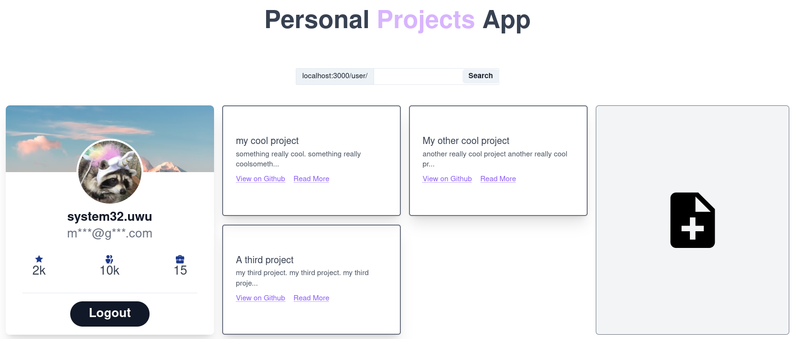

# Create T3 App

This is an app bootstrapped according to the [init.tips](https://init.tips) stack, also known as the T3-Stack.

Created with [create-t3-app](https://github.com/t3-oss/create-t3-app)

## Demo

No live demo because I have exceeded all the free tiers in existence for online databases :(.

